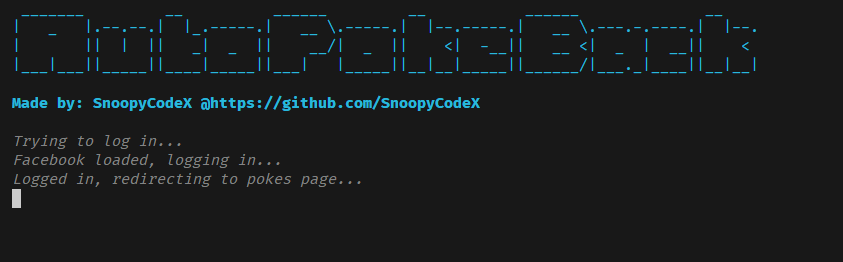
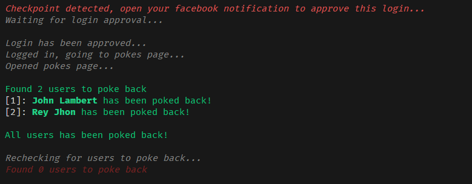

## Auto Poke Back (Facebook web crawler)

A simple web crawler made using [PuppeteerJS](https://pptr.dev) and NodeJS that automates pressing the "Poke Back" button whenever a facebook friend/user pokes you.

### Setup

First, run:

```bash
npm install
```

Then, run:

```bash

npx @puppeteer/browsers install chrome-headless-shell@latest
```

After that, open and edit the <kbd>.env</kbd> file and replace the keys with their respective values, however, the `USER_AGENT` key's value is optional and may be left as-is.

```bash
# Your facebook email address
FB_EMAIL=youremail@gmail.com

# Your facebook password
FB_PASS=yourpassword123

# Browser user agent (optional)
USER_AGENT='Mozilla/5.0 (Windows NT 10.0; Win64; x64) AppleWebKit/537.36 (KHTML, like Gecko) Chrome/123.0.0.0 Safari/537.36 Edg/123.0.2420.81'
```

Once all are done, you may then run:

```bash
node index.js
```

**NOTE:** If you encounter a checkpoint, just open your facebook account in your another device and check your notification for a login approval request. Click it and just approve your login then wait for a few seconds and this tool will detect the approval. However, facebook's login checkpoint may also mean that your account has been marked as spam or temporarily disabled by facebook.

### Preview


### Possible Improvements
- [ ] Login cookie (to avoid relogging in and going through the login checkpoint everytime)
- [ ] Incorrect email/password detection
- [ ] 2FA detection

### Disclaimer
I will not be responsible for any damages/consequences that this may cause to your and/or other's account(s). Please use at your own risk.